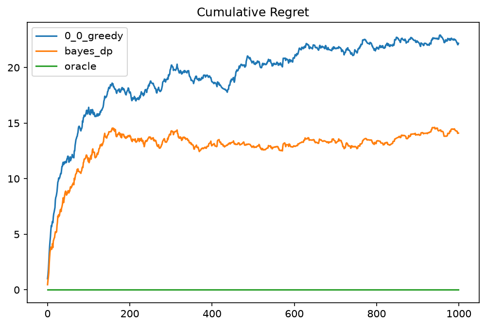
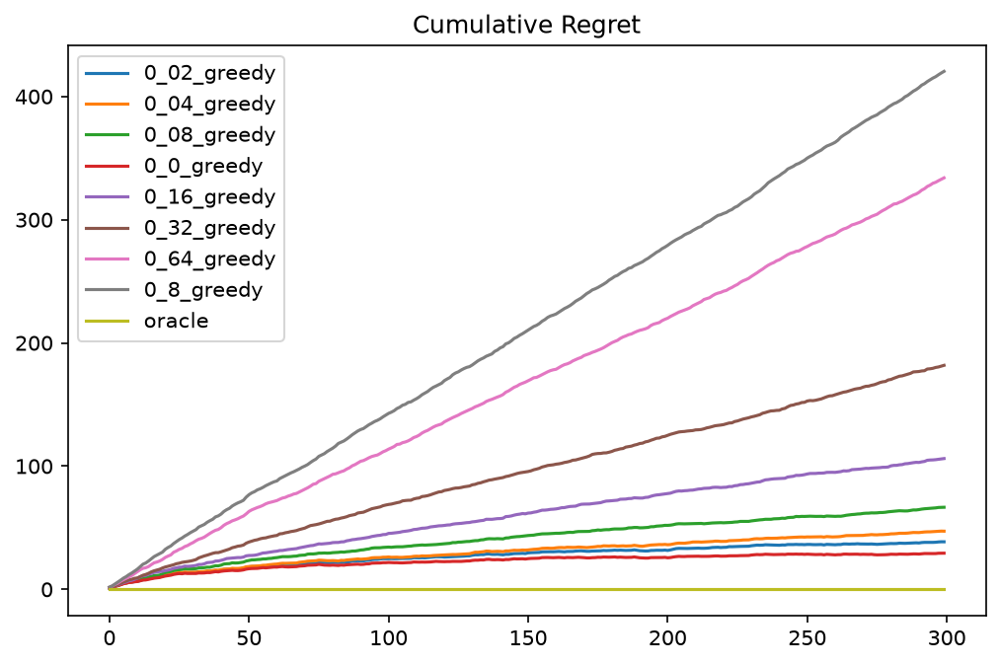

# Balloon Game

A simulator and experiment pipeline for the Balloon Analogue Risk Task (BART), treated as a
learning problem: a per-colour multi-armed bandit with geometric pop times and right-censored
feedback. The repository contains the game engine, a YAML-driven experiment harness with
reproducible seeding, a family of learning strategies (explore-then-exploit, epsilon-greedy,
Thompson sampling, a Bayes-optimal dynamic program), regret metrics and plotting, a two-player
winner-take-all mode, and five notebooks that walk through the design and the results.



*Cumulative realized regret against an oracle that knows the pop probabilities, averaged over
50 seeds of 1000 balloons. The Bayes-optimal DP agent learns faster and settles lower than
plain greedy learning.*

## The game

- A game is a sequence of `N` balloons. Each balloon has a colour, and each colour has a hidden
  pop probability `p`.
- Every pump pops the balloon independently with probability `p`, so the pop time `V` is
  Geometric(`p`). The risk does not grow with the number of pumps.
- Before each balloon the strategy commits to a threshold `k`. If the balloon survives all `k`
  pumps the strategy banks `k` points; if it pops on or before pump `k` it banks 0.
- Feedback is censored. On a pop you learn `V` exactly. On a survival you only learn `V > k`.
- With `p` known, the expected payout of threshold `k` is `k (1-p)^k`, maximised at
  `k* = max(1, ceil((1-p)/p))`. The `oracle` strategy plays this and is the benchmark for regret.
- A Beta prior on `p` stays conjugate under censoring: a pop at `v` adds one failure and `v-1`
  successes, a survival of `k` pumps adds `k` successes. Every built-in learner uses this update.

[GAME_DYNAMICS.md](GAME_DYNAMICS.md) is the complete specification: exact payout rules for both
modes, the strategy interface, sensitivity of payout to a wrong threshold, best responses and
equilibria of the head-to-head game, and implementation quirks.

## Results

Reference colour map `{red: 0.1, blue: 0.4, orange: 0.6, purple: 0.8}`, 300 balloons, 50 seeds.
Every strategy plays the same 50 balloon sequences, so the gap column is a paired difference.

| Strategy | End PnL (mean ± sd) | Gap to oracle (mean ± se) |
|---|---|---|
| `oracle` (knows `p`) | 367.7 ± 41.8 | — |
| `bayes_dp` (finite-horizon Bayesian DP) | 354.5 ± 45.1 | 13.2 ± 2.8 |
| `epsilon_greedy`, eps = 0 | 347.9 ± 44.8 | 19.8 ± 3.1 |
| `thompson_sampling` | 335.8 ± 44.0 | 31.9 ± 3.4 |

What the experiments in [notebook 03](output/notebooks/03_learning_and_regret.ipynb) show:

- **Explicit exploration never paid.** A lower epsilon won at every horizon tested (10 to 2000
  balloons) and on low, high, and spread colour maps, and eps = 0 won overall. Exploiting keeps
  learning, because a threshold near `k*` pops often enough to reveal `V`.
- **Explore-then-exploit with ratio `r` ends up where epsilon-greedy with eps = `r` does.**
- **Thompson sampling underperforms plain greedy** when a posterior sample is plugged into `k*`.
- **The best learners sit about 5% below the oracle.** The Bayes-optimal DP agent, which picks
  thresholds by posterior expected value with a value-of-information term over the remaining
  balloons of that colour, closes about a third of that gap.
- **A profiling-led redesign made the engine 48x faster** (3.4 s to 0.07 s for a 150-balloon
  run), by replacing a SQLite commit per turn with per-strategy belief updates and one commit
  per game. The before-and-after profiles are in `profiling/results`.



*Epsilon-greedy for eps from 0 to 0.8 on the `{0.1, 0.2, 0.3, 0.4}` map. Regret grows linearly
in eps and flattens to a roughly logarithmic curve at eps = 0.*

## Quickstart

Python 3.11.

```bash
git clone https://github.com/ynkos22/BalloonGame.git
cd BalloonGame
pip install -r requirements.txt
python modules/config.py
```

`python modules/config.py` runs the experiment described in [config.yaml](config.yaml):

```yaml
run_name: my_run          # output folder name
master_seed: 111          # integer
num_seeds: 50             # games per strategy, each on a different balloon sequence
num_balloons: 300
multiplayer: 0            # 0 = each strategy plays alone, 1 = head-to-head

strategies:
    - name: epsilon_greedy
      params:
        eps: 0.0          # float params must be written as floats
    - name: bayes_dp
      params: {}          # strategies without params need an empty dict

color_map:                # hidden from the strategies
    red: 0.1
    blue: 0.4
    orange: 0.6
    purple: 0.8
```

Strategy names are checked against the registry and parameters are type-checked before any game
runs. Results land in `output/game_logs/<run_name>/`: a copy of the config and one CSV per game
with columns `balloon_id, balloon_color, pop_time, strategy_name, threshold, end_PnL`. Every game
is also kept as a table in `output/db/game_logs.db`.

To plot a run, averaged over its seeds:

```python
import sys; sys.path.insert(0, "modules")
from plotting import plot_PnL_curves, plot_regret_curves

plot_PnL_curves("my_run")
plot_regret_curves("my_run")
```

## Writing a strategy

Subclass `Strategy` in [modules/strategies.py](modules/strategies.py). The subclass registers
itself under `KEY`, which is the name used in the config.

```python
class lean_greedy(Strategy):
    KEY = "lean_greedy"                  # unique, non-empty
    PARAMS = [("lean", int)]             # (name, type) pairs checked against the config

    def __init__(self, ctx, rng, lean: int):
        super().__init__(name=f"lean_greedy_{lean}", ctx=ctx, rng=rng)
        self.lean = lean
        self.memory = {c: [1, 1] for c in ctx.colors}   # [survived pumps, pops], uniform prior

    def action(self, balloon) -> int:
        surv, pops = self.memory[balloon.color]
        p = pops / (surv + pops)
        return max(1, int(np.ceil((1 - p) / p)) + self.lean)

    def update_beliefs(self, obs) -> None:
        surv, pops = self.payout_infer(obs.own_threshold, obs.pop_time)
        self.memory[obs.balloon_color][0] += int(surv)
        self.memory[obs.balloon_color][1] += int(pops)
```

Rules the engine relies on:

- `action` may use `balloon.color`, `balloon.id`, `self.ctx` (`num_balloons`, `colors`) and your
  own history. `balloon.pop_value` and `balloon.prob` are reachable but reading them is cheating.
- `action` must return a plain Python `int`, at least 1.
- Use only `self.rng` (a seeded `numpy.random.Generator`) for randomness, so runs stay reproducible.
- `update_beliefs` is called once after every balloon with an `Observation`: `balloon_color`,
  `own_threshold`, `pop_time` (the true pop time if you popped, otherwise the sentinel `999`),
  and `payout` (a dict with every player's payout that round).
- `name` must be unique within a game and filename-safe, so bake parameters into it.

[Notebook 02](output/notebooks/02_User_guide_and_extensions.ipynb.ipynb) covers this in more
detail, including how to change what information strategies receive.

## Reproducibility

One master seed generates one balloon seed per game. Each balloon seed fixes the colour sequence
and the pop time of every balloon, and then seeds a separate RNG for each strategy. As a result:

- every strategy in a run faces identical balloons, so strategies can be compared with paired
  per-seed differences instead of noisy raw means (final PnL has a standard deviation of roughly
  45 across seeds, while strategy differences are 10 to 30 points);
- the order in which strategies are listed does not change any result;
- any single game can be replayed by using its seed (in the CSV filename) as `master_seed` with
  `num_seeds: 1`.

The design notes for this are in [design/reproducibility.md](design/reproducibility.md).

## Multiplayer mode

With `multiplayer: 1` two strategies play the same balloons simultaneously, and with more than
two strategies every pair plays a round robin on every seed. Payouts change to winner-take-all:

| Outcome | Payout |
|---|---|
| Both pop | 0 and 0 |
| Only one survives | the survivor keeps their own threshold |
| Both survive | the higher threshold takes `k1 + k2`, the other gets 0 (tie: coin flip for `2k`) |

Strategies never see the opponent's threshold directly, but it can often be reconstructed from
`obs.payout`. The single-player optimum is badly exploitable here: against an opponent playing
`k*`, playing `k* + 1` nearly doubles your expected value. For low `p` there is no pure
equilibrium; the mixed equilibria are worked out in GAME_DYNAMICS.md and will be studied
empirically in notebook 05.

## Repository layout

```
config.yaml            experiment to run (see Quickstart)
GAME_DYNAMICS.md       full game specification for strategy designers
modules/
  engine.py            Game: balloon generation, the balloon loop, payouts, observations
  strategies.py        Strategy base class, registry, and all strategies
  core.py              Balloon, Observation, Context
  e2e_harness.py       YAML parsing and validation, seeding, game construction, saving
  config.py            entry point: python modules/config.py
  metrics.py           realized regret, averaging over seeds
  plotting.py          PnL and regret curves for a run
  sql_handling.py      per-game SQLite tables and CSV export
  paths.py             output locations
design/                design notes and flowcharts (engine, strategies, experiments, seeding)
output/
  game_logs/<run>/     config.yaml plus one CSV per game
  plots/               every figure used in the notebooks, <run>_PnL.png and <run>_regret.png
  notebooks/           the write-up (below)
  db/                  SQLite database of every game run
profiling/             cProfile harness, timing scripts, and the before/after profiles
tests/                 unit tests (see Status)
```

## Notebooks

1. [Game overview](output/notebooks/01_game_overview.ipynb): the game, the design of the
   engine, the profiling story behind the 48x speedup, and the seeding design.
2. [User guide and extensions](output/notebooks/02_User_guide_and_extensions.ipynb.ipynb):
   writing strategies, changing the information strategies receive, running experiments.
3. [Learning and regret](output/notebooks/03_learning_and_regret.ipynb): regret metrics,
   baselines, explore-then-exploit versus epsilon-greedy, the search for the optimal epsilon,
   Thompson sampling.
4. [AI agents](output/notebooks/04_AI_agents.ipynb) (in progress): GAME_DYNAMICS.md was written
   as a complete spec and given to an LLM (Claude) with the instruction to design the best
   strategy it could. The `bayes_dp` strategy in `strategies.py` is what it produced, and the
   notebook evaluates it against the hand-written learners.
5. [Multiplayer](output/notebooks/05_multiplayer.ipynb) (in progress): empirical dynamics and
   equilibrium analysis of the head-to-head game.

## Status

- Notebooks 04 and 05 are being written; 05 currently contains only its outline.
- The unit tests in `tests/` were written against an earlier version of the engine and do not
  currently import. Rewriting them against the current harness is on the list in
  [FIXME.md](FIXME.md).
- The `bayes_dp` strategy was designed by an LLM from the written spec, as described above; all
  other code is hand-written.
