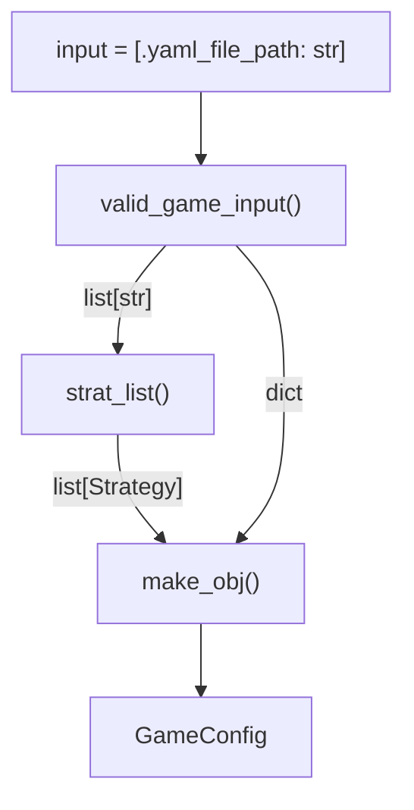
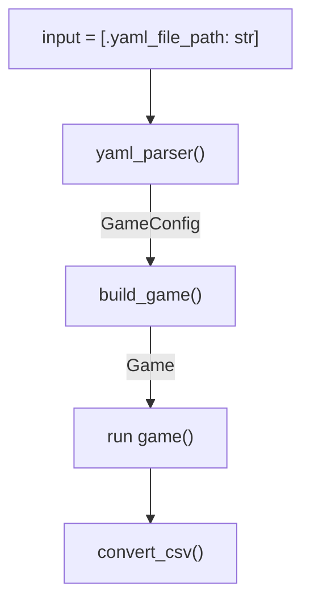
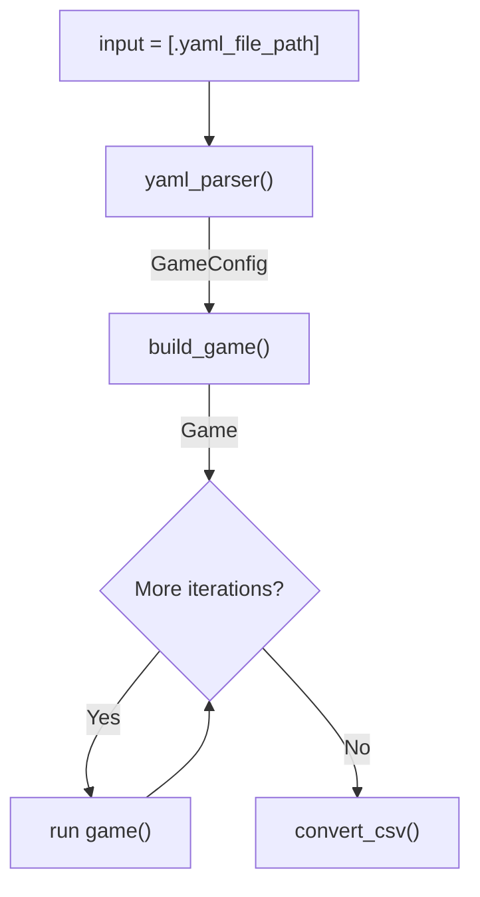

# yaml_parser()

```mermaid
flowchart TD
    n1["input = [.yaml_file_path: str]"]
    n2["valid_game_input()"]
    n3["strat_list()"]
    n4["make_obj()"]
    n5["GameConfig"]

    n1 --> n2
    n2 -- list[str] --> n3
    n3 -- list[Strategy] --> n4
    n2 -- dict --> n4
    n4 --> n5
```
# start_game()

```mermaid
flowchart TD
n1["input = [.yaml_file_path: str]"]
n2["yaml_parser()"]
n3["build_game()"]
n4["run game()"]
n5["convert_csv()"]

n1 --> n2
n2 -- GameConfig --> n3
n3 -- Game --> n4
n4 --> n5
```

# start_tourney()

```mermaid
flowchart TD
n1["input = [.yaml_file_path]"]
n2["yaml_parser()"]
n3["build_game()"]
n4["run game()"]
n5["convert_csv()"]
n6{"More iterations?"}

n1 --> n2
n2 -- GameConfig --> n3
n3 -- Game --> n6 
n6 -- Yes --> n4
n6 -- No --> n5
n4 --> n6
```

