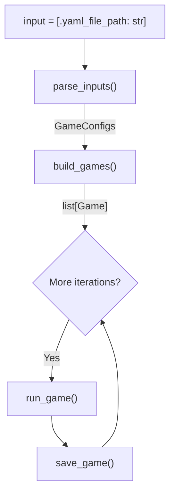

# yaml file format
To start an experiment, fill the .yaml file apropriately. This is an example:

```yaml
master_seed: 10111

num_seeds: 50

num_balloons: 100

multiplayer_mode: 0

strategies:
    - name: constant_pump
    params: pump_times
    - name: thompson_sampling
    params: 

color_map:
    red: 0.2
    blue: 0.4
    orange: 0.7
```
NOTE: master_seed needs to be an integer, and if strategies have no parameters simply leave it blank as the example shown. Multplayer_mode is enabled with an entry of 1, and disabled with an entry of 0. If more than 2 strategies are entered into multiplayer mode, then a round-robin is played where for each seed every strategy will face every other strategy. num_seeds denotes how many individual GAME SEEDS there are, and each game csv is named with the individual seed. This seed can also be used as a master seed to replay a specific matchup.


# experiment()
This is the high level sequence that runs every time you run an experiment. Game information is specified in a .yaml file. This file path is then inputted into the parse_inputs() function, which checks validity of the content in the .yaml file. 

If the inputs are good, It then returns a GameConfig object that holds the details of the games that will be run, else it raises valueError with reason here and terminates execution. 

build_games() then constructs a Game object for each of the games, and returns a list of them. Further logic of build_games() is specified in the actual code. Each of these games will then be run using the run_game() function. 

During each call to run_game() game information is recorded into the SQL database. The records are then converted to csv in save_game(). 

Note: GameConfigs includes information about MULTIPLE SEEDS as well as whether or not round robin mode is played. Thus, build_games() will return a LIST of ALL games that will be played. 




