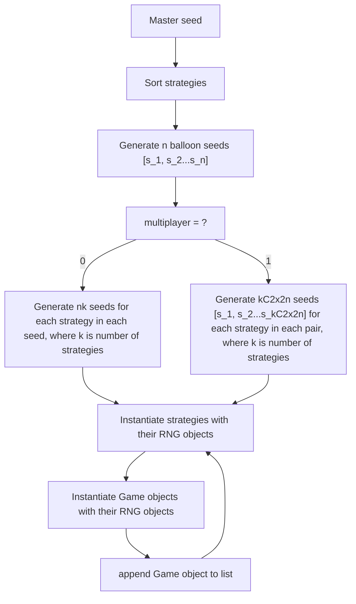

```mermaid 
flowchart TD
master_seed["Master seed"]
seeds["Generate n balloon seeds [s_1, s_2...s_n]"]
seeds_mult["Generate kC2x2n seeds [s_1, s_2...s_kC2x2n] for each strategy in each pair, where k is number of strategies"]
strat_sort["Sort strategies"]
Instance_strat["Instantiate strategies with their RNG objects"]
Instance_games["Instantiate Game objects with their RNG objects"]
multiplayer["multiplayer = ?"]
save["append Game object to list"]
seeds_single["Generate nk seeds for each strategy in each seed, where k is number of strategies"]

master_seed --> strat_sort


strat_sort --> seeds --> multiplayer -- 1 --> seeds_mult

multiplayer -- 0 --> seeds_single --> Instance_strat

Instance_games --> save --> Instance_strat
seeds_mult --> Instance_strat --> Instance_games


```