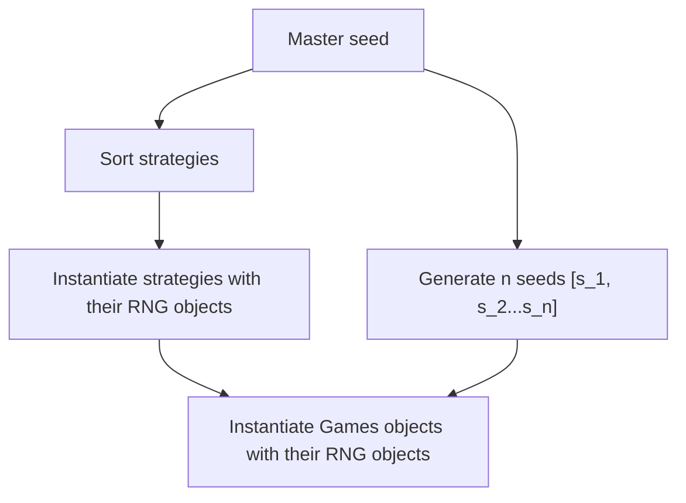

```mermaid 
flowchart TD
master_seed["Master seed"]
seeds["Generate n seeds [s_1, s_2...s_n]"]
strat_sort["Sort strategies"]
Instance_strat["Instantiate strategies with their RNG objects"]
Instance_games["Instantiate Games objects with their RNG objects"]

master_seed --> seeds & strat_sort
strat_sort --> Instance_strat --> Instance_games
seeds --> Instance_games

```