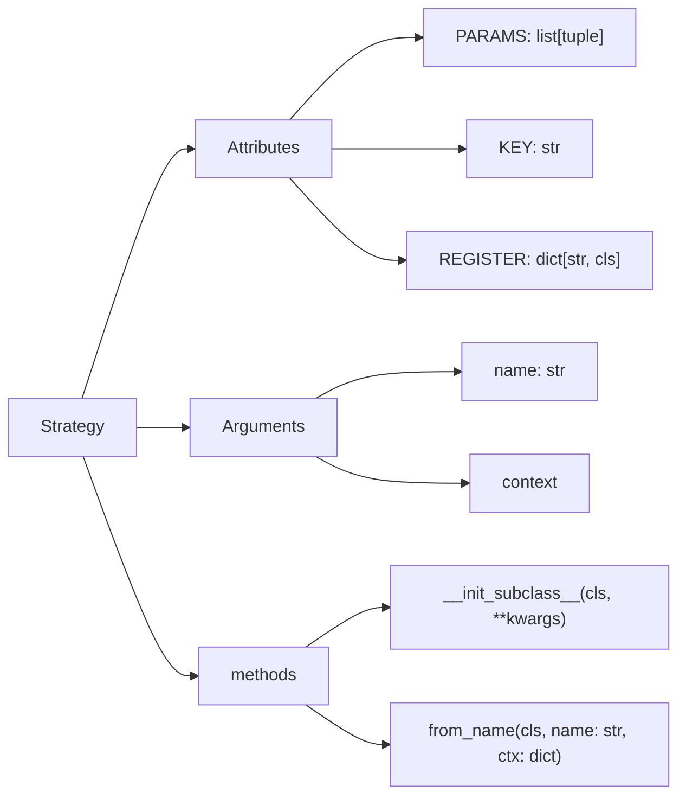

This is the parent class for every strategy (default strategies and custom user-made strategies). When user defines their own strategies, they have to specify the strategy's KEY and PARAMS if they have any. Each parameter in PARAMS list is in the following form:

(attr_name, type)

For example, ("pump_value", int)

REGISTER is a dictionary that maps strategy keys to the apropriate class. 

At initialization of subclasses (custom strategies) it checks if its key is in REGISTER, and adds key-value pair if it does not contain it already. If it already contains the key, an exception is raised informing of a duplicate strategy. 

from_name() returns a STRATEGY INSTANCE given the parameters, class, and context. 

